### Kipon Dynamics 365 plugin template
This project is a Visual Studio template solution for builing Dynamics 365 plugins

It has three sub projects:

#### Kipon.Dynamics.Plugin
This is the assembly project. You are suppose to rename this to match your customer and needs, and build you own plugins here.

#### Kipon.Dynamics.SvcFilter
This is a very simple filter DLL, that can be added to the CrmSvcUtil.exe command line tool as /codewriterfilter to ensure that
the crmsvcutil tool only generate entities that is needed.

#### Kipon.PluginRegistration
Normally you would use the Dynamics 365 plugin registration tool to registre your plugins in Dynamics 365. This simple command line tool
is an alternative approach, and registre you plugins if you decorate your plugin classes with Step(..) attributes, defined in Kipon.Dynamics.Plugin.Attributes folder.
The advantage of this approach is that you are always sure that plugins are registred according to your need, defined in the code, and it is visible inside
the code how the plugin is registred. ONLY use the Kipon.PluginRegistration tool against your developer box. You should use solution to transport the plugins
to your test and production environment.

Basically this allow you to write codes that is telling how the assembly plugin type should be deployed, so your code and the actual configuration is
always in sync.

#### Installation guide

##### 1) Download the project from GIT

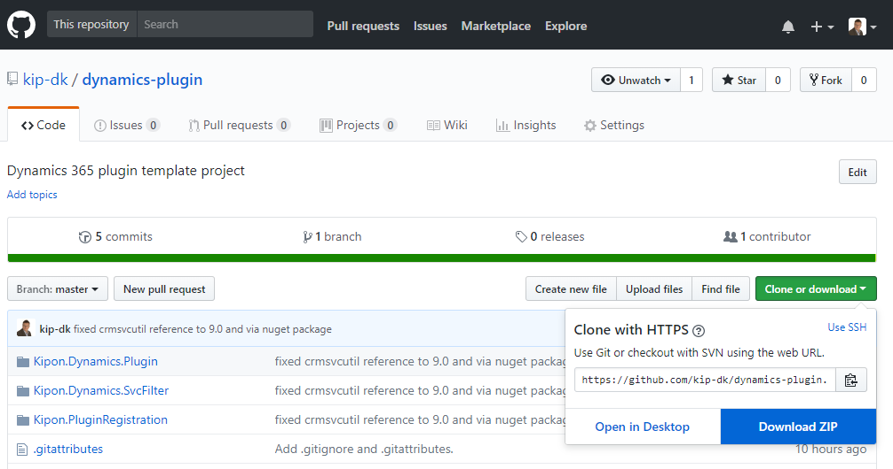

##### 2) Open the ZIP file and copy the folder to a new project location

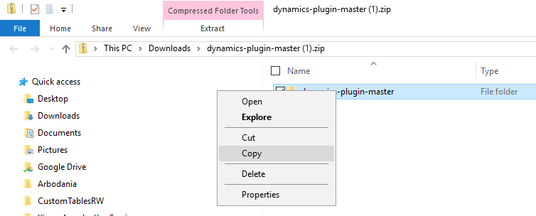

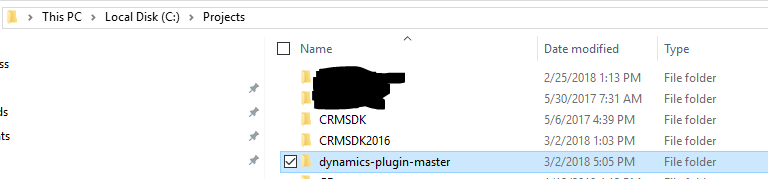

##### 3) Rename the folder to match your need

Ex. dynamics-plugin-master > Demo

##### 4) Navigate into the solution folder and rename the solution:

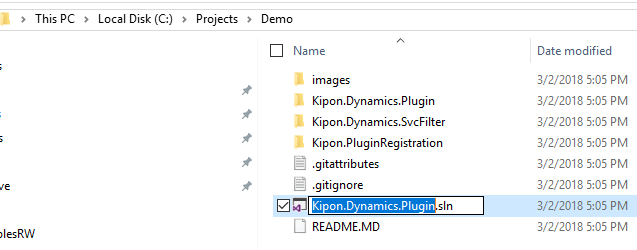

#### 5) Rename the plugin project to match your need
You should rename the project named Kipon.Dynamics.Plugin to match your need. 
First rename the folder, secondly, navigate into the folder and rename the project file

The solution folder should look like this (Replace Demo with your name)

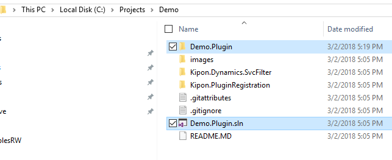

And the Demo.Plugin folder now looks like this:

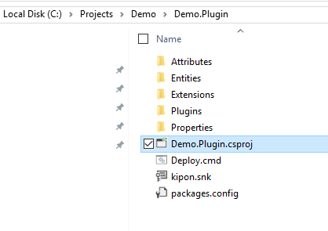

#### 5) now you are ready to open the project in visual studio.
Navigate to the root folder and dobble click on the ?.sln file

Make sure you have Visual Studio 2017 installed before you do that :-)

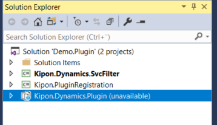

As you can see, the project is missing the Kipon.Dynamics.Plugin folder.
That is because we renamed it in above steps. Simply delete the folder from the solution,
and the add the solution fil from its new name:

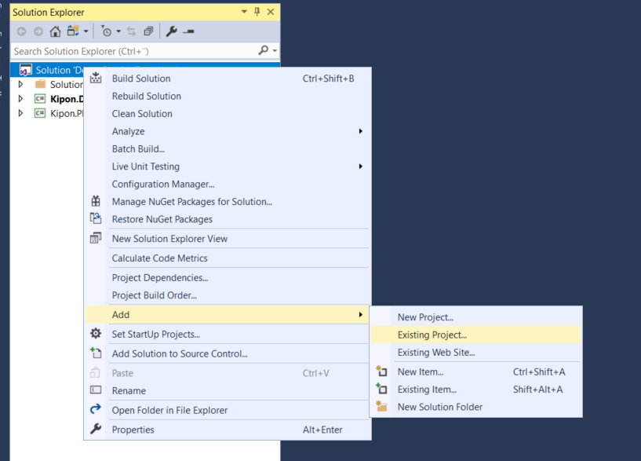

After you added the Demo.Plugin project, you shoulde be able to compile.  The Kipon.Dynamics.SvcFilter might give 
some headeck. Sometimes the NuGet Package for Microsoft.CrmSdk.CoreTools is not downloaded.

the you must go the the Nuget package manager, remove the reference from the project, and add it again. Finally
you might need to remove the reference to crmsvcutil.exe, and add it again. After you installed the above nuget
package, the file can be found in your project under ..\yourproject\Kipon.Dynamics.SvcFilter\bin\coretools

#### 6) Now rename the namespace used for your plugin project (Demo.Plugin). 
For the Kipon.Dynamics.SvcFilter and the Kipon.PluginRegistration, you can just keep the namespaces. It is very
generic code that you will problerbly not need to change, and this code will never be deployed elsewhere than
on your developer box.

Your library, renamed from Kipon.Dynamics.Plugin to ex. Demo.Plugin, however should use a proper namespace.

Rightclick in the solution view on the project folder, and navigate to properties.

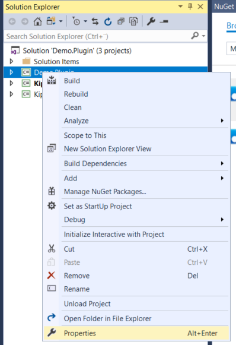

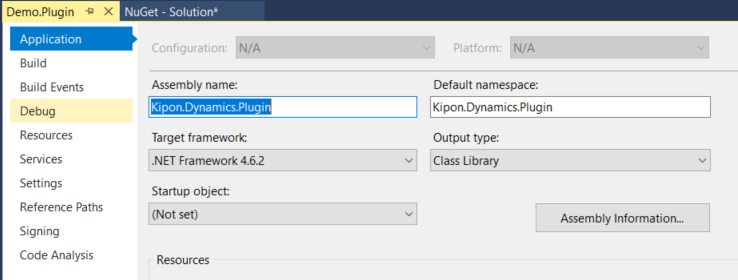

Change the assembly name, and the namespace to fit your need.

You should also change the namespace in the classes within the Demo.Plugin project. Simply use search and replace:

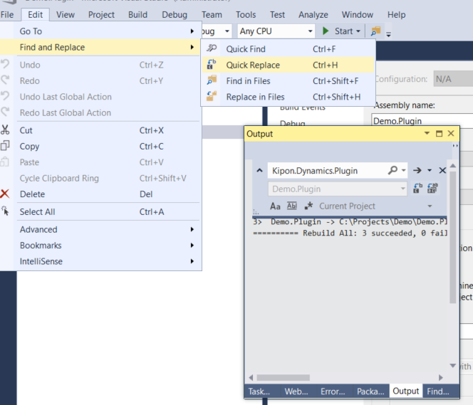

Replace "Kipon.Dynamics.Plugin" with "Demo.Plugin"

Now ensure that the solution can still compile. Because you did a global replace of namespace for single project containing your
assembly code, it should all compile.

#### 7) Setup early bound entity generation.
Generation of early bound entities has been prepared as much as possible for you, but you must adjust the scripts to match your environment

Open the Demo.Plugin project in the solution view, and navigate to the folder call "Entities"

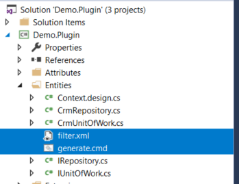

As you can see, this folder contains two central files. "filter.xml" and "generate.cmd".
The filter.xml file is a simple XML file where you list the entities you need. That way the crmsvcutil only generates code that you actually need.
The generate.cmd is a simple command line tool you can call to generate the entites.

You must adjust the filter.xml to match your need.

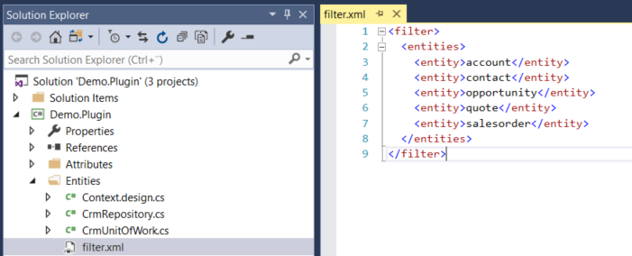

And you must adjust the generate.cmd to match your url, user and password.

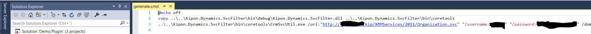

Now you should be able to generate early bind entities by calling the generate.cmd tool

Open a command line, and navigate to the Demo.Plugin/Entities folder and run the generate.cmd command tool

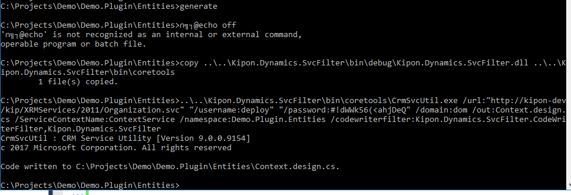

Now build your solution see that it still compiles.

#### 8) Registre your plugin
You can ofcause choose to registre your plugin, simply by using the SDK pluginregistration tool. This solution does however
offer an alternative approach, registre your plugins from class decorations.

The Kipon.PluginRegistration command line tool, embeded in this template solution offer this functionality, but you need to configure
the connection string to your environment before you can use it.

Open the Kipon.PluginRegistration project and navigate to the app.config file

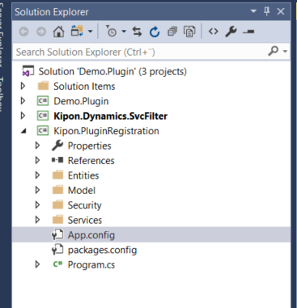

In this file you will find a tag called <kiponSec .../>
You just need to adjust the url and the username password to match your need, and then recompile the solution.
The file contains an active example on-premises, and also an example how to specify an online login.
Remember to recompile. The app.config changes will not be populated to the bin folder before you compile.

#### 9 Deploy your code.
Finally you are ready to deploy the code. In the root of the Plugin project (here Demo.Plugin) you will find 
a command line tool called Deploy.cmd. Open a command prompt and run that tool to deploy your code

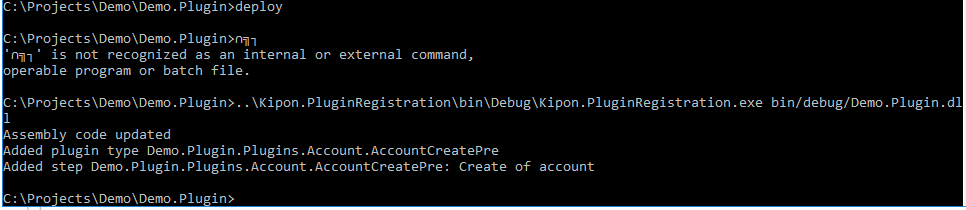

#### To come for thouse who stay on.
This project offer an AbstractBasePlugin that you can be used as a solid base class for your plugins. You can let
your plugins extend this class to easy up the standard wiring on connecting to CRM. 

I will soon extend this documentation with detail description on how this base plugin is used to create
high quality plugins with less hassel. So stay on.

### Happy plugin coding

## License
MIT © [Kipon ApS, 2018](mailto:kip@kipon.dk)

